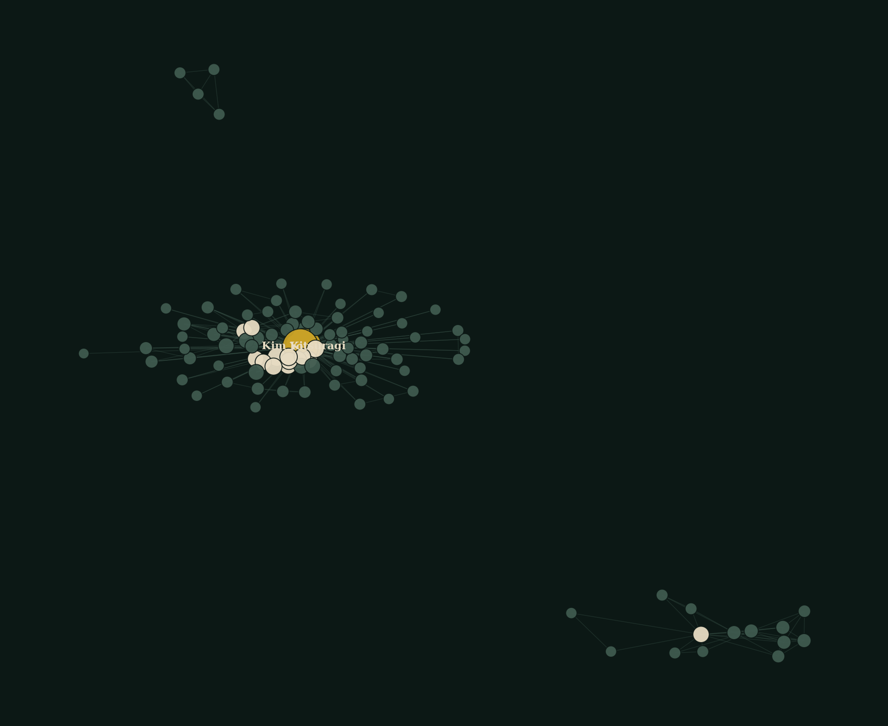
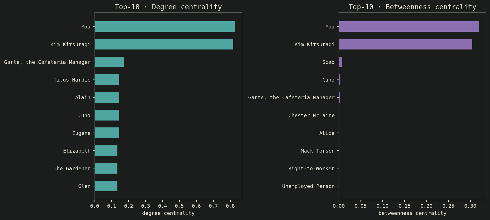
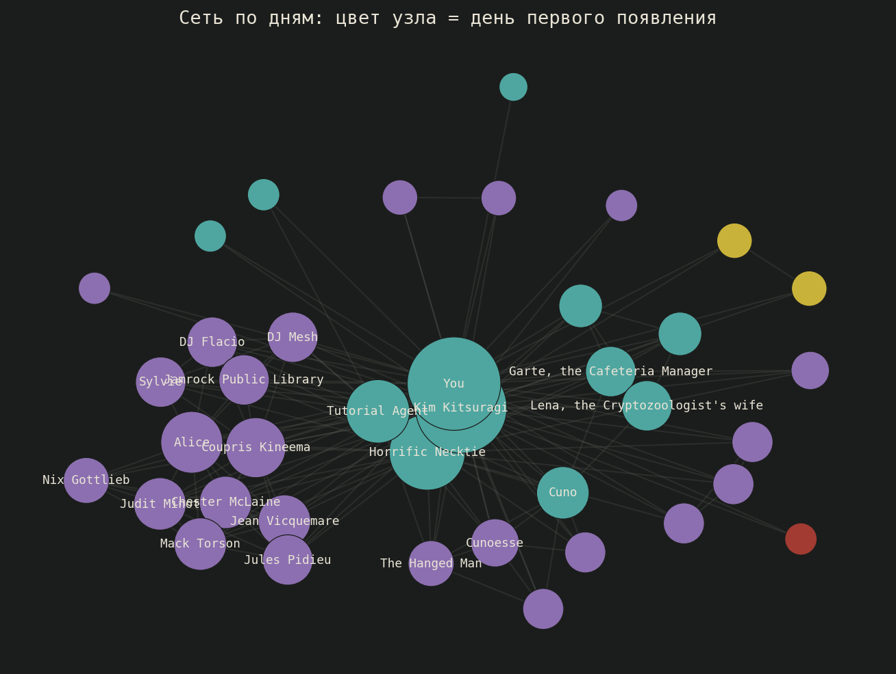
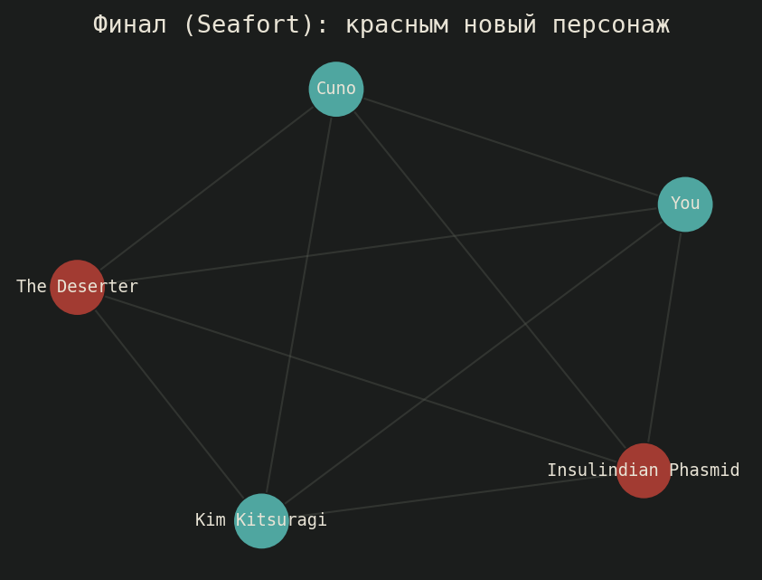

# Сетевой анализ персонажей Disco Elysium

## О проекте

Сеть совместных появлений персонажей Disco Elysium, построенная по датамайнинговому дампу диалоговой базы игры.

Вопрос: как нарративная позиция персонажа (начало игры, основная часть, финал) формирует его положение в этой сети.

Главные результаты:

1. Сеть и ее устойчивость проверены через degree/betweenness centrality (Гарри и Ким - лидеры по обеим метрикам, ожидаемо для игры с двумя сквозными протагонистами); по дороге найдена и зафиксирована методологическая ошибка: передача частоты co-occurrence как `weight` в `betweenness_centrality` ошибочно трактуется networkx как расстояние, а не как сила связи.
2. Временная ось (63 верифицированные сцены из 590) показывает резкий ввод состава персонажей на 1-2 день игры и затухание к 4-5.
3. В финальной сцене (Seafort) 2 из 5 персонажей не встречаются нигде в остальной игре, и оба напрямую связаны с разгадкой.

## Данные

Источник: [github.com/msyavuz/disco-api](https://github.com/msyavuz/disco-api), файл `disco.db` (SQLite, примерно 40 МБ). Производные таблицы (ребра сети, метрики), которые ноутбук сохраняет при выполнении, лежат в [`data/`](data/).

## Визуализации

**Полный граф связей** (105 узлов, 368 ребер) - все совместные появления персонажей.

→ [интерактивная версия](viz/full_network.html)

*Узлы - персонажи, ребра - совместные появления в одной сцене; чем толще ребро, тем чаще пара встречается вместе.*

**Центральность персонажей** - degree и betweenness centrality, с пояснением найденной методологической ошибки.

*Degree показывает, с кем персонаж пересекается чаще всего; betweenness - какие персонажи связывают разные группы между собой.*

**Граф по дням** - как состав действующих персонажей меняется по ходу игры (63 сцены с подтвержденным днем из 590).

→ [интерактивная версия](viz/day_axis_network.html)

*Персонажи расположены по оси игрового дня их первого появления; видно, как состав резко расширяется в начале и сужается к финалу.*

**Финальная сцена (Seafort)** - локальный подграф последней сцены игры.

→ [интерактивная версия](viz/seafort_network.html)

*Показывает только участников финальной сцены и их связи; двое из пяти персонажей нигде больше не появляются.*

## Методология

1. Из диалогового дампа извлечены пары персонажей, появляющихся в одной сцене. Построен граф: 105 узлов, 368 ребер.
2. Рассчитаны degree и betweenness centrality для каждого персонажа.
3. Размечена временная ось: для 63 из 590 сцен удалось верифицировать игровой день.
4. Выделена и проанализирована финальная сцена (Seafort) как отдельный подграф.

## Материалы

- [Ноутбук с полным кодом анализа](disco_elysium_network_analysis.ipynb)

